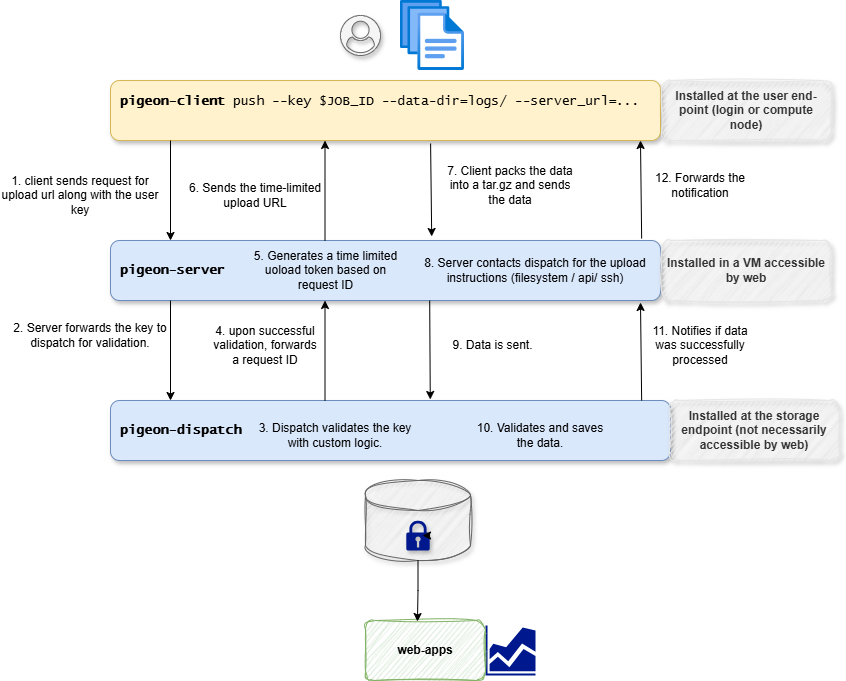

# LAAB-Pigeon

**Pigeon** enables **secure, token-based uploads** of data between web-application storage and their users. This repository contains the following  three independently installable software components.

- `pigeon-client` — a CLI for the users to interact with the web-application storage.
- `pigeon-server` — a Flask API that serves as an intermediate layer that handles the token-based communication between the client and the web-application storage.
- `pigeon-dispatch` — Enables the web-application to implement custom logic for validating and processing the data uploaded by the user.

## Installation

### Where to install each component

- `pigeon-client`: install at the user-facing side (for example user VM, login node, or service host that initiates uploads).
- `pigeon-server`: install at the HTTP endpoint exposed to `pigeon-client`.
- `pigeon-dispatch`: install with the web-application backend where object key validation and final upload processing logic are implemented.

### Pre-installation requirements

- Python 3.9+.
- Remaining package dependencies are handled by `pyproject.toml` during install.

### Install commands

Default installation includes only the `pigeon-client` component:

```bash
pip install .
```

For other components, use:

```bash
pip install '.[server]'
pip install '.[dispatch]'
```

## Workflow

The typical workflow for a user uploading data using `pigeon` is as follows:

1. `pigeon-client` requests an upload URL from the `pigeon-server` by providing an `object_key` that identifies the user and type of data they want to upload.

2. `pigeon-server` forwards the `object_key` to the `pigeon-dispatch` service for validation. If successful, an upload URL that is valid for a short time is returned to the client. 

3. `pigeon-client` uploads the data to the provided URL, which is received by `pigeon-server` and forwarded to the `pigeon-dispatch` service for final processing (e.g. moving to a final storage location, triggering downstream processing, etc). If the dispatch service confirms successful processing, the client receives a success response.

**Further instructions:**

- [Pigeon Client](packages/pigeon_client/README.md)
- [Pigeon Server](packages/pigeon_server/README.md)
- [Pigeon Dispatch](packages/pigeon_dispatch/README.md)

**Flow Diagram:**



## Example

An end-to-end example with all three components is available here: [End-to-End Example: `pigeon`](example/README.md)

## Copyright and License

Copyright (c) 2026 Forschungszentrum Juelich GmbH, Juelich Supercomputing Centre

Contributers: 
    - Aravind Sankaran

This software is licensed under the BSD 3-Clause License. See [LICENSE](LICENSE) for details.
